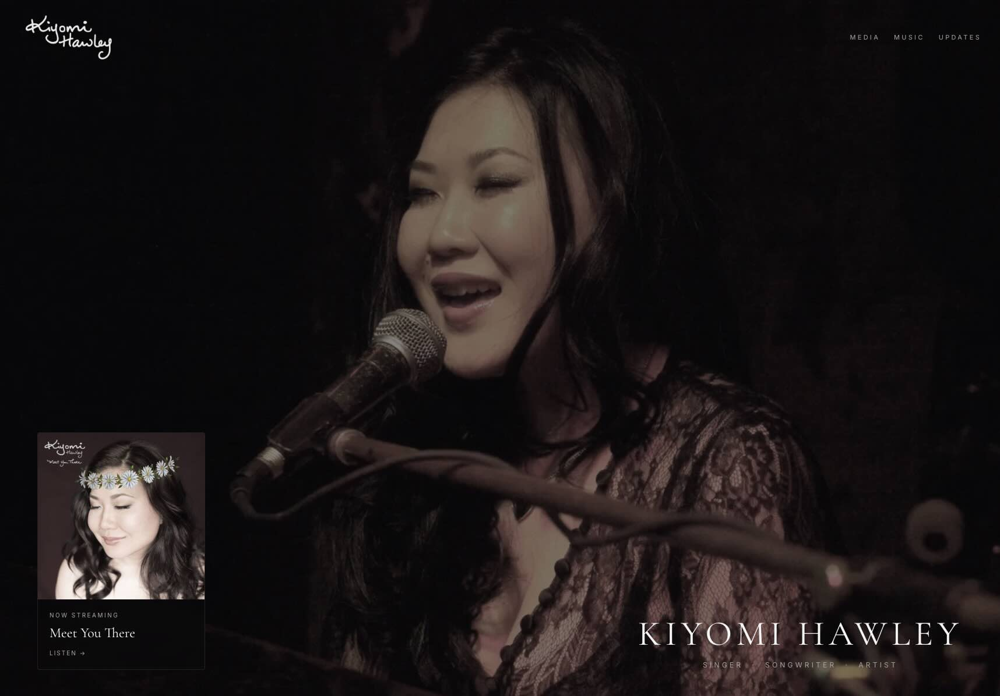

# A Practical Stack for an Artist Website

{ .app-shot }

Most websites do not break all at once.

They slowly become harder to update, harder to trust, and eventually outdated.

The redesign of kiyomihawley.com started with a simple constraint:

> Keep it easy to maintain, even months after launch.

<!-- more -->

## The Goal

This was not a design-first project.

It was an operating model decision.

The requirements were clear:

- Easy to update without logging into a CMS  
- Fast to deploy with minimal friction  
- Stable across external dependencies  
- Flexible enough to grow with new content  

In simple terms:

> The site should support the work, not create more of it.

## What Changed

The previous version leaned more on manual updates and less structured content.

The redesign shifts to a code-first model with a few consistent patterns:

- Content is defined in structured files  
- Components render directly from those files  
- External services are used only where they add clear value  

There is no CMS.

That is intentional.

## Content Without a CMS

All content updates happen in code.

In practice:

- Discography is managed in a single TypeScript file  
- Media and press are grouped into structured arrays  
- Updates are written as small, consistent objects  

Each section follows the same rule:

> Structured input, predictable output.

This avoids:

- Formatting inconsistencies  
- Hidden state across systems  
- Logging into multiple tools just to make a small change  

It also makes version control straightforward.

## Deployment and Operations

The deployment model is deliberately simple.

- Push to the main branch  
- Vercel automatically builds and deploys  
- Changes are live within minutes  

No manual release steps.

No separate deployment process.

That matters more than it sounds.

When updates are easy, they actually happen.

## Tech Stack

The site uses a small, explicit stack.

Not minimal for the sake of it, but constrained on purpose.

| # | Component        | Details                                                                 |
|---|------------------|-------------------------------------------------------------------------|
| 1 | **Framework**    | Next.js (App Router) for routing, server-side rendering, and data fetching |
| 2 | **Frontend**     | React with TypeScript                                                   |
| 3 | **Hosting**      | Vercel with automatic deployments on push to main                       |
| 4 | **Content**      | Code-based content (TypeScript files in `/lib` for music, media, updates) |
| 5 | **Data Store**   | Upstash Redis (visitor count, Instagram token storage)                  |
| 6 | **Integrations** | Instagram Graph API, SoundCloud embed, YouTube embed                    |
| 7 | **Automation**   | Vercel cron job (weekly Instagram token refresh)                        |
| 8 | **Caching**      | Next.js caching (1-hour cache for Instagram feed data)                  |
| 9 | **DNS**          | Dreamhost managing domain routing                                       |

A few intentional decisions behind this:

- **Next.js instead of a static-only site**  
  Allows small dynamic features without introducing a full backend  

- **Vercel for hosting**  
  Removes operational overhead and simplifies deployment  

- **Redis instead of a database**  
  Supports lightweight state without adding unnecessary complexity  

- **Code-based content instead of a CMS**  
  Keeps everything version-controlled and predictable  

The broader point:

> The stack supports the operating model, not the other way around.

## Automation

There are only a few moving parts, but each removes manual work:

- A scheduled cron job refreshes the Instagram access token weekly  
- The token is stored in Redis and reused across requests  
- Instagram feed responses are cached to reduce API calls  

There is also a fallback path if the token is missing on first deploy.

The goal is not to eliminate failure.

It is to make failure recoverable.

## Handling Real-World Integrations

The most fragile part of most sites is not the UI.

It is the integrations.

For example, the Instagram feed:

- Pulls directly from the Instagram Graph API  
- Uses a long-lived token that is automatically refreshed  
- Falls back to an environment variable if Redis is empty  
- Caches responses to avoid rate limits  

No third-party widgets.

Fewer external dependencies.

More control over behavior.

## Design Decisions That Matter

A few small choices make a meaningful difference over time:

- **No CMS**  
  Reduces complexity and long-term maintenance  

- **Structured content files**  
  Keeps updates consistent  

- **Automatic deployments**  
  Encourages frequent, low-friction updates  

- **Minimal state**  
  Avoids debugging hidden issues  

- **Clear separation of concerns**  
  Content, components, and integrations are easy to reason about  

None of these are complex individually.

Together, they make the system durable.

## Tradeoffs

This approach is not perfect.

A few tradeoffs are intentional:

- Content updates require code changes  
- Non-technical edits are not built in  
- Some integrations require manual recovery if they fail  

Those are acceptable here.

Because the priority is long-term maintainability.

## Current State

The site is now:

- Fast to update  
- Stable in production  
- Structured in a way that is easy to understand  

Most importantly, it does not require constant attention.

## What Comes Next

Future updates will likely stay within the same model:

- Expanding content sections as needed  
- Refining how updates and releases are presented  

But the constraint remains:

> If it adds maintenance overhead without clear value, it does not get added.

## Closing Thought

A website for a working artist has a different job.

It needs to:

- Represent the work clearly  
- Stay current without friction  
- Handle real-world updates without breaking  

Everything else is secondary.

The real test is not how it looks on launch day.

It is whether it is still accurate, usable, and easy to update over time.

If you want to see how that looks in practice, you can explore it here:

[https://kiyomihawley.com](https://kiyomihawley.com){ target="_blank" rel="noopener" }

*Joe Hawley*  
Cybersecurity Director  
M.S. Cybersecurity Graduate Student, Georgia Institute of Technology