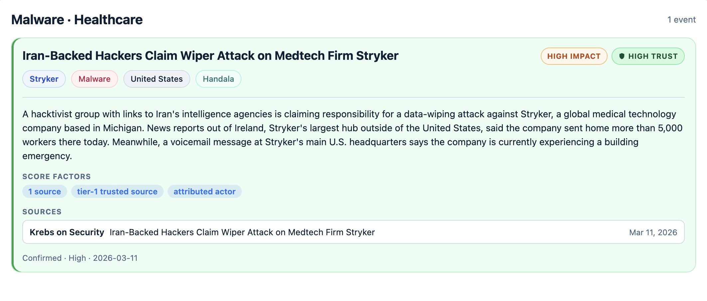
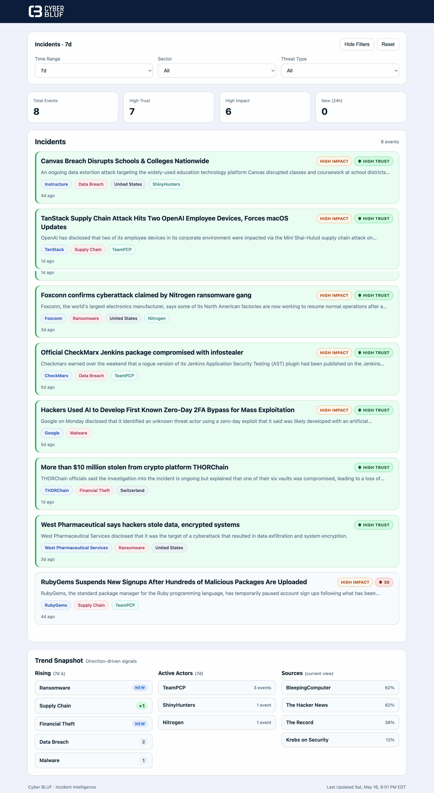

# Building Cyber BLUF

## BLUF

Cyber BLUF answers one narrow question:

> What confirmed cyber incidents involving named organizations happened recently, and who is behind them?

It is not a news aggregator, ransomware tracker, SIEM, vulnerability feed, or comprehensive threat intelligence platform.

It is a curated incident intelligence surface built around structured, deduplicated events. Every event shown has a named victim. The unit of value is the event, not the article.

{ .app-shot }

Cyber BLUF started from a simple frustration.

There is no shortage of cybersecurity information. News feeds, advisories, research blogs, vendor reports. But most of it is fragmented, repetitive, and difficult to interpret when you just want to understand:

- What actually happened
- Who was affected
- Whether it is confirmed
- Who is behind it

<!-- more -->

## Cyber BLUF in Practice

{ loading=lazy .app-shot }
*Filtered view showing named-victim cyber incidents in a high-signal feed.*

## What Cyber BLUF Is (and Isn’t)

Cyber BLUF is intentionally narrow in scope.

It is:

- A **single-page cyber incident brief**
- Focused on **recent, named-victim cyber incidents**
- Designed to be read in **under a minute**
- Built around **structured, deduplicated events**

It is not:

- A SIEM
- A ransomware tracker
- A vulnerability feed
- A news aggregator
- A comprehensive threat intelligence platform

The core idea is simple:

> The primary unit of value is the event, not the article.

## Product Floor

Every event shown in the feed must have a named victim organization.

That constraint is intentional.

Actor-only campaign reporting may still be useful threat intelligence, but it is not the product Cyber BLUF is trying to be.

In simple terms:

> No named victim, no feed event.

This reduces volume, but it protects trust in the output.

## How It Works

At a high level, Cyber BLUF takes messy, real-world reporting and turns it into structured incident events.

### Pipeline

1. **Ingest**
   - RSS feeds from curated sources
   - CISA KEV JSON feed
   - CISA advisory RSS feed with strict filtering
   - SEC EDGAR cybersecurity disclosures

2. **Process**
   - Remove irrelevant or low-signal content
   - Filter out legal follow-ups, marketing, and general guidance
   - Separate incident reporting from advisory-style activity

3. **Extract**
   - Identify named victim organizations when clearly stated
   - Infer threat types such as ransomware, phishing, breach, or exploitation
   - Capture geography, CVEs, and related structured fields
   - Leave fields empty when confidence is weak

4. **Cluster**
   - Group related articles into unified events
   - Prevent duplicate reporting from appearing as separate incidents
   - Compute deterministic confidence scores based on source quality and corroboration

5. **Attribute**
   - Match threat actors against a curated knowledge base
   - Require explicit attribution language before assigning actors
   - Discard generic or weak attribution

6. **Serve**
   - Deliver a clean, structured event feed through the API
   - Render a simple, scannable UI

The pipeline is intentionally deterministic.

AI may help fill small gaps, but deterministic logic remains the foundation of the system.

## Trust and Impact

Cyber BLUF separates two concepts that often get blended together:

- **Trust**
- **Impact**

A high-trust event is supported by stronger evidence, such as:

- Multiple corroborating sources
- Primary disclosures
- Trusted-alone sources like SEC EDGAR or Krebs on Security

A high-impact event may involve:

- Ransomware
- Widespread exploitation
- Critical infrastructure
- Material disclosures
- Known threat actors
- Large-scale breaches

These labels are independent.

An event can be high impact but lower trust. It can also be high trust without being high impact.

Separating the two makes the feed easier to interpret quickly.

## Tech Stack

Cyber BLUF is intentionally simple from a technology standpoint. The goal was a clean, deterministic pipeline rather than a complex system.

| # | Component        | Details                                                               |
|---|------------------|-----------------------------------------------------------------------|
| 1 | **Backend**      | Python + Flask with Flask-SQLAlchemy and Flask-Migrate                |
| 2 | **Database**     | PostgreSQL                                                            |
| 3 | **Frontend**     | Vanilla JavaScript with client-side filtering and localStorage        |
| 4 | **Ingestion**    | RSS feeds, JSON sources, and SEC EDGAR APIs                           |
| 5 | **Processing**   | Rule-based filtering for relevance and incident quality               |
| 6 | **Extraction**   | Deterministic parsing for victims, threat types, geography, and CVEs  |
| 7 | **Clustering**   | Lightweight matching to group related articles into unified events    |
| 8 | **Attribution**  | Deterministic threat-actor matching against a curated knowledge base  |
| 9 | **Automation**   | Scheduled pipeline execution via Render Cron                          |
| 10 | **Runtime**     | Gunicorn                                                              |

## Automation

The system runs on a scheduled loop:

- Ingest new data
- Process and extract incident signals
- Cluster related reporting into events
- Attribute known actors where supported
- Update the feed

The deployment model intentionally separates responsibilities.

The web service serves the API and UI. It is fast and read-only on enriched data.

The cron job runs the pipeline and is the only process permitted to mutate enriched event data.

That operational boundary matters. It keeps request handling predictable and prevents accidental enrichment changes from normal web traffic.

## Working with Real-World Data

The most challenging part of the build was not the UI or the infrastructure.

It was the data.

Real-world cybersecurity reporting is inconsistent. Titles are vague. Summaries mix narrative with boilerplate. Advisory feeds often contain structured content that does not behave like normal reporting.

A few lessons shaped the current approach:

- **Only extract what is clearly present**
  If a victim is not explicitly named, leave it empty.

- **Unknown is better than wrong**
  Avoid forcing geography, industry, or attribution when the signal is weak.

- **False positives are worse than false negatives**
  A smaller clean feed is more useful than a larger feed users cannot trust.

- **Not all sources are equal**
  Some sources can stand alone. Others require corroboration.

- **Fix the pipeline, not the symptom**
  If one article exposes a recurring issue, improve the pipeline stage rather than patching individual events.

One example was advisory-style content. Much of it created noise instead of useful incident visibility. The solution was not to ingest more aggressively, but to become more selective about what qualified as a meaningful event.

## Design Philosophy

A few principles guided the build:

- **Deterministic logic first**
- **Quality over recall**
- **Structured events over raw articles**
- **Consistency over cleverness**
- **Clarity over completeness**

The UI reflects that:

- Minimal layout
- Structured cards
- Trust and impact labels
- Fast scanning
- No unnecessary metrics

If something cannot be understood quickly, it probably does not belong.

## Current State

At this stage, Cyber BLUF is stable as an MVP:

- Live ingestion from curated sources
- Named-victim incident filtering
- Multi-source deduplication
- Deterministic confidence scoring
- SEC EDGAR disclosure integration
- Threat actor attribution where supported
- Reliable scheduled updates
- Structured, readable output

It is intentionally constrained in scope.

That constraint is part of the product design, not a limitation.

## What Comes Next

Future directions will likely focus on:

- Expanding source coverage carefully
- Improving extraction normalization
- Refining event evolution over time
- Adding lightweight historical context
- Improving attribution quality where patterns repeat

But any additions will follow the same rule:

> If it increases complexity without improving clarity, it does not get added.

## Closing Thought

A lot of cybersecurity tooling optimizes for volume.

Cyber BLUF optimizes for clarity.

That tradeoff influences almost every technical and product decision in the system.

The goal is not to show everything.

The goal is to make it easier to understand what actually matters right now.

If you want to see how that looks in practice, you can explore it here:

[https://signal.joehawley.com/](https://signal.joehawley.com/){ target="_blank" rel="noopener" }

*Joe Hawley*  
Cybersecurity Director  
M.S. Cybersecurity Graduate Student, Georgia Institute of Technology