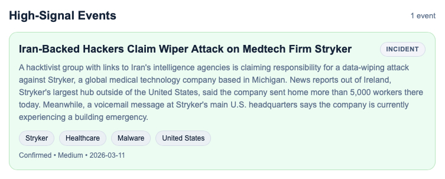
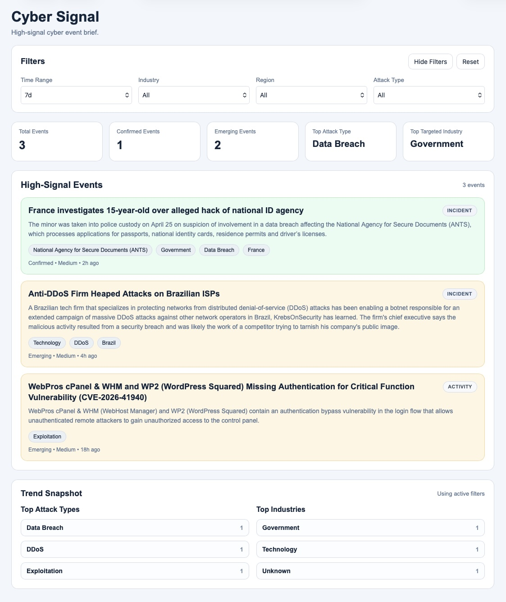

# Building a High-Signal Cyber Event Brief

{ .app-shot }

Cyber Signal started from a simple frustration.

There is no shortage of cybersecurity information. News feeds, advisories, research blogs, vendor reports. But most of it is fragmented, repetitive, and difficult to interpret when you just want to understand:

- What actually happened  
- Who was affected  
- What type of attack it was  
- Whether it matters  

The goal with Cyber Signal was not to build another dashboard or intelligence platform. It was to build something much simpler:

> A clean, structured view of meaningful cyber events.

<!-- more -->

## Cyber Signal in Practice

{ loading=lazy .app-shot }
*Filtered view showing incidents and activity in a single high-signal feed.*

## What Cyber Signal Is (and Isn’t)

Cyber Signal is intentionally narrow in scope.

It is:

- A **single-page event brief**
- Focused on **recent, meaningful cyber activity**
- Designed to be read in **under a minute**

It is not:

- A SIEM  
- A threat intelligence platform  
- A vulnerability database  
- A full analytics tool  

The core idea is simple:

> The primary unit of value is the event, not the article.

## How It Works

At a high level, Cyber Signal takes messy, real-world reporting and turns it into structured events.

### Pipeline

1. **Ingest**
   - RSS feeds from curated sources (Krebs, BleepingComputer, The Record)
   - CISA KEV JSON feed
   - CISA advisory RSS feed (with strict filtering)

2. **Process**
   - Remove irrelevant or low-signal content  
   - Filter out legal follow-ups, marketing, and general guidance  

3. **Extract**
   - Identify victim (only when clearly stated)
   - Infer attack type (ransomware, breach, exploitation, etc.)
   - Assign industry only when supported by evidence  
   - Normalize summaries into short, readable statements  

4. **Cluster**
   - Group related articles into a single event  
   - Prevent duplication across repeated reporting  

5. **Serve**
   - Deliver a clean, structured event feed via API  
   - Render a simple, scannable UI  

Everything is deterministic. No scoring engines, no heavy AI layers, no opaque logic.

## Tech Stack

Cyber Signal is intentionally simple from a technology standpoint. The goal was a clean, deterministic pipeline rather than a complex system.

| # | Component        | Details                                                                 |
|---|------------------|-------------------------------------------------------------------------|
| 1 | **Backend**      | Python + Flask (modular services and blueprints)                       |
| 2 | **Database**     | SQLite (local) with SQLAlchemy ORM                                     |
| 3 | **Frontend**     | Vanilla JavaScript + minimal HTML/CSS                                  |
| 4 | **Ingestion**    | RSS feeds (news + CISA advisories) + JSON (CISA KEV)                   |
| 5 | **Processing**   | Rule-based filtering for relevance and signal quality                  |
| 6 | **Extraction**   | Deterministic parsing for victim, attack type, industry, and summary   |
| 7 | **Clustering**   | Lightweight matching to group related articles into events             |
| 8 | **Scheduler**    | APScheduler for automated pipeline execution                           |
| 9 | **Runtime**      | Gunicorn (local/LAN testing)                                           |

## Automation

The system runs on a simple scheduled loop:

- Ingest new data  
- Process and extract signals  
- Cluster into events  
- Update the feed  

A lightweight scheduler runs the full pipeline at a fixed interval and tracks:

- last run time  
- success/failure  
- pipeline stage results  

The goal was reliability and clarity, not complexity.

## Working with Real-World Data

The most challenging part of the build was not the UI or the pipeline.

It was the data.

Real-world cybersecurity reporting is inconsistent. Titles are vague. Summaries mix narrative with boilerplate. Advisory feeds include structured content that does not behave like normal articles.

A few lessons that shaped the current approach:

- **Only extract what is clearly present**  
  If a victim is not explicitly named, leave it empty  

- **Unknown is better than wrong**  
  Avoid forcing industry or geography when the signal is weak  

- **Short summaries matter**  
  Long advisory text destroys scanability  

- **Not all sources are equal**  
  Some feeds require filtering or simplification to be usable  

One example was CISA advisories. Raw output was unusable in a feed. The solution was not to parse everything, but to reduce it to a single, clean sentence or drop it entirely.

## Design Philosophy

A few principles guided the build:

- **Clarity over completeness**  
- **Consistency over cleverness**  
- **Deterministic behavior over heuristics**  
- **Signal over volume**  

The UI reflects that:

- minimal layout  
- structured cards  
- no unnecessary metrics  
- fast scanning  

If something cannot be understood quickly, it does not belong.

## Current State

At this stage, Cyber Signal is stable as an MVP:

- Live ingestion from multiple sources  
- Clean event clustering  
- Reliable scheduled updates  
- Structured, readable output  

It is not feature-complete, and that is intentional.

## What Comes Next

Future directions will likely focus on:

- Expanding source coverage carefully  
- Improving extraction where patterns repeat  
- Introducing a lightweight historical layer  
- Refining how events evolve over time  

But any additions will follow the same constraint:

> If it increases complexity without improving clarity, it does not get added.

## Closing Thought

There is a lot of value in stepping back from raw data and asking a simpler question:

> What actually matters right now?

Cyber Signal is an attempt to answer that question in a consistent way.

Still early, but it is starting to feel useful.

*Joe Hawley*  
Cybersecurity Director  
M.S. Cybersecurity Graduate Student, Georgia Institute of Technology