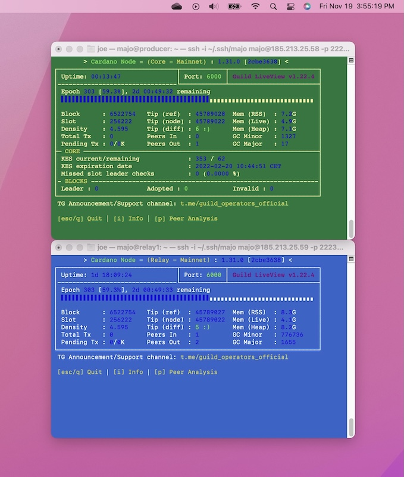

# Building a Fractal Meshify C Homelab for Blockchain

{ .float-right width=225 }

In late 2021, I assembled this homelab in the Fractal Design Meshify C to dive deep into blockchain technology and NFTs. What started as curiosity quickly became hands-on mastery: launching my own Cardano stake pool, producing real blocks to secure the network, and minting my own NFTs on-chain using this architecture.

This project was a perfect mix of hardware tinkering, secure Linux setup, and distributed systems, which is exactly the kind of hands-on challenge I love.

<!-- more -->

The homelab began as the full testbed and later became a redundant relay in production.

## Hardware Specs

A budget-friendly, server-grade setup optimized for 24/7 reliability and ECC memory:

| Component          | Details                                                                 |
|--------------------|-------------------------------------------------------------------------|
| Case              | Fractal Design Meshify C - Black                                        |
| Motherboard       | Supermicro X10SRL-F LGA2011-3                                           |
| CPU               | Intel Xeon E5-2630 v3 2.4 GHz ($109)                                    |
| CPU Cooler        | Supermicro 4U Active CPU Heatsink SNK-P0050AP4                          |
| PSU               | Corsair RM750x 750 Watt, 80+ Gold, Fully Modular                        |
| GPU               | MSI GeForce GT 710 1GB                                                  |
| RAM               | 2× Supermicro 16GB 288-Pin ECC Registered                               |
| SSD               | WD Blue 3D NAND 250GB                                                   |
| HDD               | WD Blue 1TB 7200 RPM                                                    |
| NIC               | TP-Link AX3000 Wi-Fi 6 PCIe Adapter                                     |

## Primary Purpose and Architecture

Core motivation: Understanding blockchain mechanics and NFT creation on Cardano's secure, proof-of-stake network.

Key outcomes:

- **Block Production**: The isolated block producer validated transactions, participated in consensus, and minted blocks, directly contributing to network security.
- **NFT Minting**: Using cold keys and this setup, I successfully minted NFTs on-chain.

*Full topology—isolated block producer, AWS relays, homelab relay, Grafana monitoring, SSH+2FA access, and air-gapped cold storage.*

## Build, Test, and Launch Process

Assembly in the Meshify C was straightforward and rewarding. I originally documented the full build and early stake pool setup, but a drive failure wiped those archives, becoming a tough lesson in redundancy that sharpened my cybersecurity habits (now with robust multi-layer backups).

The process: design → local testing → AWS deployment → mainnet launch → iterative tuning.

## Outcomes and Metrics

The stake pool ran reliably:

- Excellent block propagation and uptime
- Consistent epoch participation and block production
- Successful on-chain NFT mints
- End-to-end proof of a secure, functional architecture

The deepest reward was tangible understanding of decentralized systems.

## Image Gallery

-   
    __Finished Exterior__  
    Clean black Meshify C front panel.

-   
    __Internal View 1__  
    Supermicro board, Noctua cooler.

-   
    __Internal View 2__  
    PSU, primary SSD, tidy cabling.

-   
    __Unboxing & Parts__  
    Boxes ready for assembly.

-   
    __System Monitoring__  
    Grafana health and performance gauges.

-   
    __Live Nodes__  
    Block and relay nodes in gLiveView.

## Reflections

This project delivered blockchain knowledge from the ground up—producing blocks that secure a global network, minting NFTs that persist forever on-chain, and learning hard lessons about data resilience. Neurodiversity turned deep-focus debugging sessions into breakthroughs. It mirrors enterprise leadership: design resilient systems, mitigate risks, and back everything up rigorously.

If you're curious about staking, NFTs, or homelab builds, start small—the hands-on learning is unmatched.

*Joe Hawley*  
Fortune 500 Director | CISSP  
M.S. Cybersecurity Graduate Student @ Georgia Institute of Technology