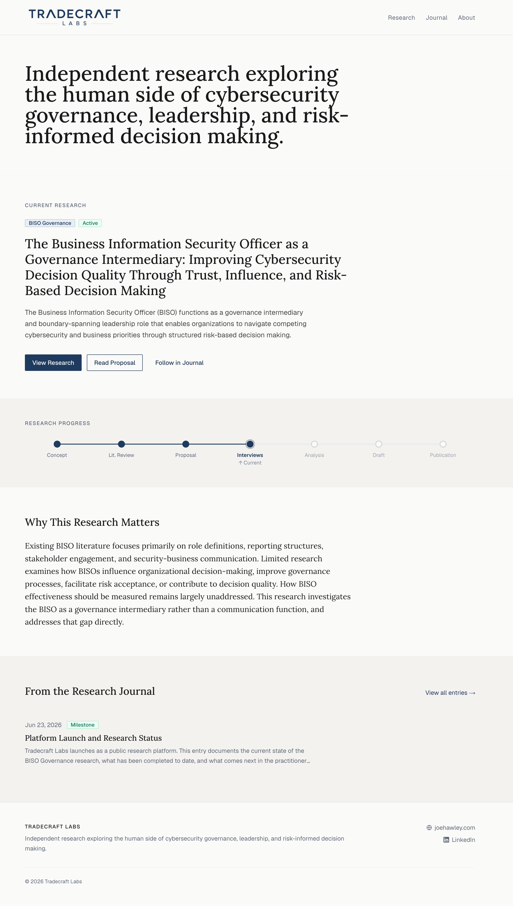

# Building Tradecraft Labs

Most research is only visible once it's finished.

By the time you read the final paper, the interesting part has already happened. Questions have evolved, assumptions have been challenged, literature has reshaped the direction of the work, and conversations with practitioners have refined the ideas.

I wanted to make that process visible.

Tradecraft Labs documents cybersecurity governance research from initial concept through publication.

It isn't a personal blog, consulting website, portfolio, or traditional academic repository.

It's a place to share how research develops over time.

Every project includes the research question, literature review, working theories, practitioner interviews, research journal, and eventually the final paper. The goal is to make the research process itself visible rather than only publishing the final result.

{ .app-shot }

Tradecraft Labs started from a simple observation.

Research is often presented as a finished product, but the thinking behind it is where much of the value is created.

Questions change.

Ideas evolve.

Evidence challenges assumptions.

Almost none of that process is visible.

I wanted to build something that documented the thinking instead of only the outcome.

<!-- more -->

## Why Build It?

This project started as part of my Georgia Institute of Technology M.S. Cybersecurity program.

As I began organizing literature, developing a research proposal, and planning practitioner interviews, I realized much of the supporting work had value beyond the final paper.

Research proposals.

Annotated bibliographies.

Literature matrices.

Working theories.

Research journals.

These artifacts rarely get shared publicly, yet they represent much of the thinking that ultimately shapes the research.

Tradecraft Labs gives those artifacts a home.

## How It Works

The platform organizes research around the lifecycle of a project rather than around traditional website pages.

Current sections include:

- Research
- Research artifacts
- Research journal
- Publications
- About

The research journal captures meaningful milestones as the work progresses.

Research artifacts evolve as new evidence is collected.

The final paper becomes one artifact among many rather than the only output.

The platform is intentionally designed so future research projects can follow the same structure.

## BISO Governance

The first project hosted on Tradecraft Labs is:

**The Business Information Security Officer (BISO) as a Governance Intermediary: Improving Cybersecurity Decision Quality Through Trust, Influence, and Risk-Based Decision Making.**

The research began with a straightforward question.

What creates value in the BISO role?

Initially, I expected communication to be the primary answer.

As the literature review expanded and I compared it with practitioner perspectives, the research shifted toward governance, trust, influence, and organizational decision-making.

That shift is exactly why I wanted to document the work publicly.

Changing your thinking as the evidence develops isn't a weakness. It's part of doing good research.

## Design Philosophy

A few principles guide both the platform and the research.

- Research before opinion
- Evidence before conclusions
- Progress over perfection
- Quality over quantity
- Clarity over complexity

The platform intentionally avoids unnecessary visual complexity.

The content should always remain the focus.

## Current State

Tradecraft Labs is currently supporting the active research phase of the BISO Governance project.

Completed work includes:

- Research proposal
- Literature review
- Annotated bibliography
- Literature matrix
- Working thesis
- Research insights
- Interview framework
- Research platform

The next phase focuses on practitioner interviews, qualitative analysis, and refining the conceptual model before writing the final paper.

## What Comes Next

Over the coming months, the platform will continue to evolve alongside the research.

The immediate focus is on:

- Conducting practitioner interviews
- Analyzing interview data
- Refining the working thesis
- Publishing additional research artifacts
- Completing the final research paper

Longer term, I hope Tradecraft Labs grows into a collection of research exploring cybersecurity governance, leadership, enterprise risk, and organizational decision-making.

## Closing Thought

Good research isn't just about reaching a conclusion.

It's about asking better questions, challenging assumptions, and following the evidence wherever it leads.

Tradecraft Labs is my way of making that process visible.

Whether the current working thesis ultimately holds or changes completely, I think there's value in documenting the questions, evidence, and decisions that shape the work along the way.

You can follow the research as it develops here:

[https://tradecraft-labs.vercel.app/](https://tradecraft-labs.vercel.app/){ target="_blank" rel="noopener" }

*Joe Hawley*  
Cybersecurity Director  
M.S. Cybersecurity Graduate Student, Georgia Institute of Technology