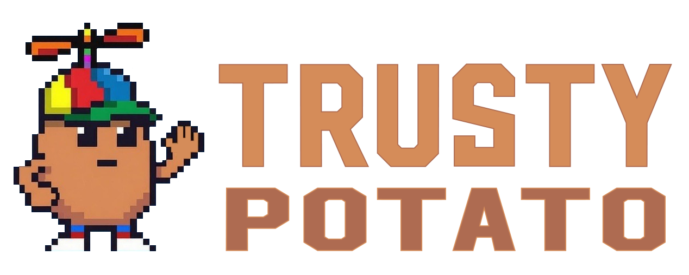
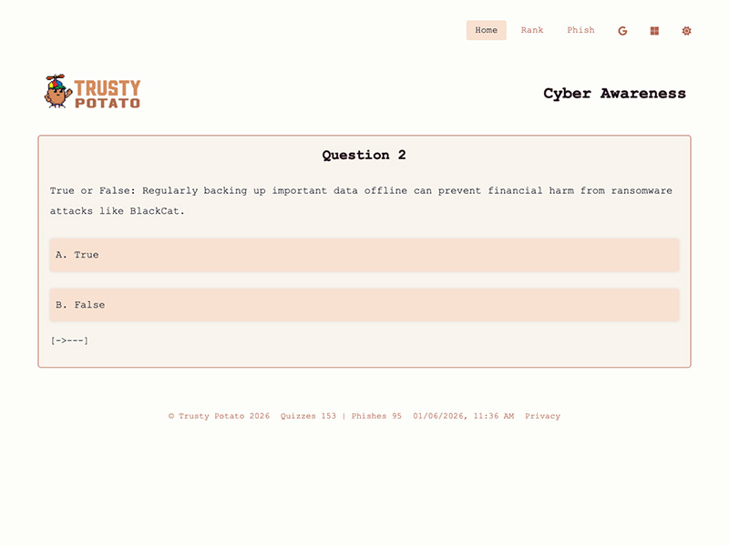
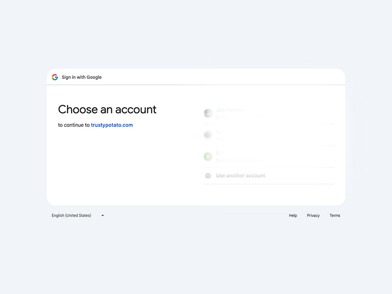
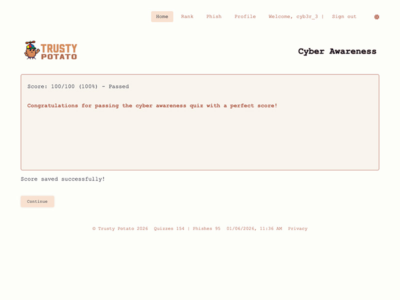
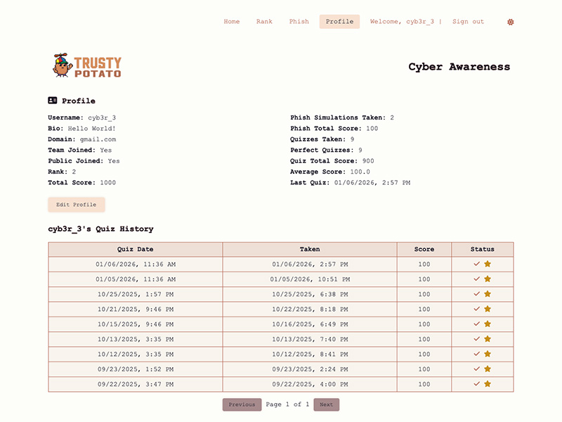

# Building a Fun Daily Cybersecurity Trainer in Trusty Potato

{ alt="Trusty Potato mascot" }

**Trusty Potato** is a lightweight, always-fresh web app that turns cybersecurity awareness into a quick daily habit. Every day it pulls the latest security headlines and generates new quizzes + phishing simulations so users can test themselves against current threats via retro aesthetic with a friendly potato mascot.

The goal? Make learning about phishing, ransomware, exploits, and social engineering feel engaging with a bit of friendly competition.

<!-- more -->

## Project Gallery

- { loading=lazy }
  __Homepage Headline__  
  Retro terminal view with animated "Defend Cyber Awareness" title.

- { loading=lazy }
  __Daily Quiz Active__  
  Answering fresh questions pulled from today's security headlines.

- { loading=lazy }
  __Quiz Results__  
  Score breakdown with explanations and pass/fail status.

- { loading=lazy }
  __Sign In Prompt__  
  Google OAuth login to save your progress and scores.

- { loading=lazy }
  __Score Saved__  
  Confirmation message after logging in—your quiz is now recorded.

- { loading=lazy }
  __Phish Simulation__  
  Spot and click suspicious elements (red flags) in the mock email.

- { loading=lazy }
  __Rankings View__  
  Weekly/all-time/team leaderboards with user ranks and scores.

- { loading=lazy }
  __Profile Stats__  
  Personal totals, averages, history, and privacy settings.

## Tech Stack & Key Features

| # | Component              | Details                                                                 |
|---|------------------------|-------------------------------------------------------------------------|
| 1 | **Backend**            | Python + Flask (blueprints for clean routing)                           |
| 2 | **Database**           | PostgreSQL — stores users, scores, headlines, quizzes, phish sims      |
| 3 | **Frontend**           | Vanilla JS modules, dark/light mode, responsive terminal styling       |
| 4 | **Content Engine**     | Daily RSS parsing → AI-generated quizzes & phish sims (via xAI)        |
| 5 | **Scheduler**          | APScheduler — auto refresh content, post daily teaser to X             |
| 6 | **Auth**               | Google & Microsoft OAuth for saving scores & profiles                   |
| 7 | **Deployment**         | Render (Git-based CI/CD from dev/main branches)                         |
| 8 | **Mascot**             | Trusty Potato — friendly potato with propeller hat                |

## How It Works Right Now (Jan '26)

- Pulls latest security news from trusted RSS feeds (Krebs, Dark Reading, etc.)
- Generates 5-question quizzes and 4–7 red-flag phishing simulations automatically
- Users take the daily content anonymously or sign in to save scores
- Leaderboards show weekly/all-time/team rankings (great for company groups)
- Profiles track total score, perfect quizzes, phish completions, and history
- Every day at 11:11 AM ET, the app tweets a fun teaser question with the mascot

The terminal-style UI, animated typing effect, and potato mascot keep the experience light-hearted while delivering serious, timely content.

## Current Status & Next Steps

The core loop is live and stable: daily refresh → quiz/phish generation → user engagement → leaderboards. As of January 2026, Trusty Potato has served over **150 quizzes** and **95 phish simulations**.

Next priorities:

- Add more granular team/org features
- Improve mobile experience for quick daily checks
- Expand headline sources and AI prompt tuning for even better questions
- Publish a public API for embedding mini-quizzes elsewhere

If you're interested in cybersecurity awareness with a playful twist, give it a try at [https://trustypotato.com/](https://trustypotato.com/){ target="_new" rel="noopener" }. 

Feedback always welcome!

*Joe Hawley*  
Fortune 500 Director | CISSP  
M.S. Cybersecurity Graduate Student @ Georgia Institute of Technology