# Building a Compact Homelab: Fractal Terra with Ryzen 7

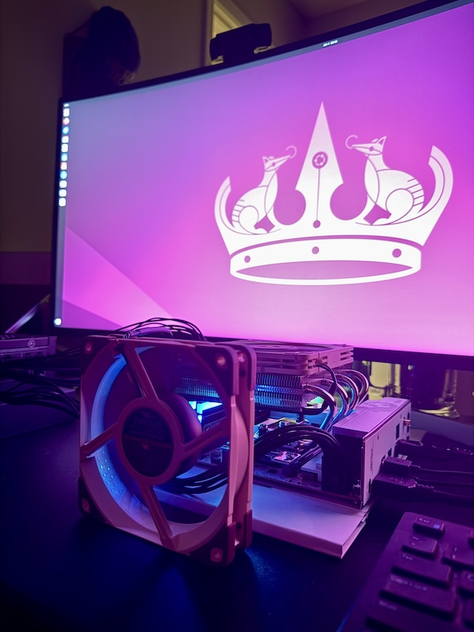{ alt="Building a Compact Homelab" .float-right width=225 }

This project documents the ongoing build of a small-form-factor (SFF) homelab server housed in the beautiful Fractal Design Terra Jade case (with walnut front panel). The primary goals are a **quiet, power-efficient, always-on system** capable of:

- KVM virtualization
- Docker/Podman containers
- Development work and graduate research
- Network IDS/IPS using Suricata

<!-- more -->

## Build Process Gallery

- 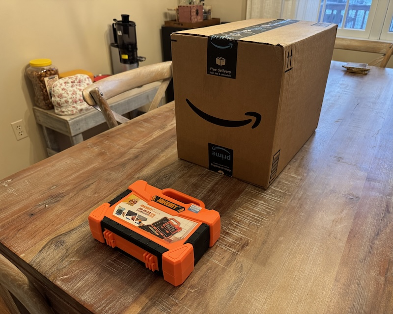{ loading=lazy }
  _Box of parts_

- 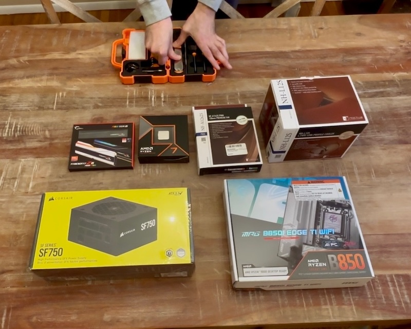{ loading=lazy }
  _Unboxed boxes - Core components_

- 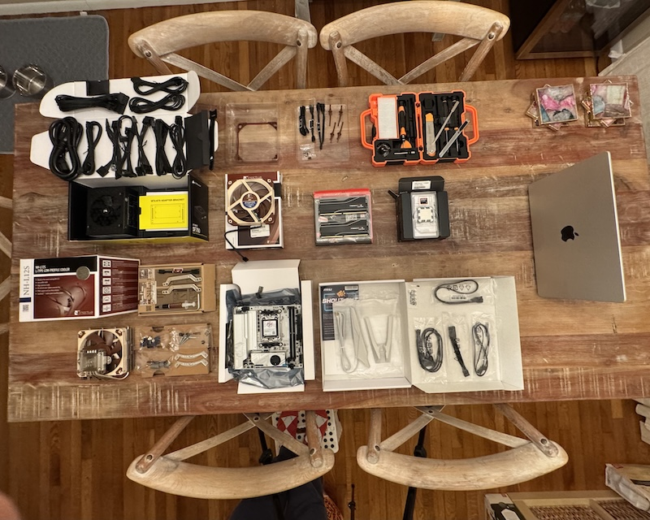{ loading=lazy }
  _Boxes unboxed - The fun begins_

- 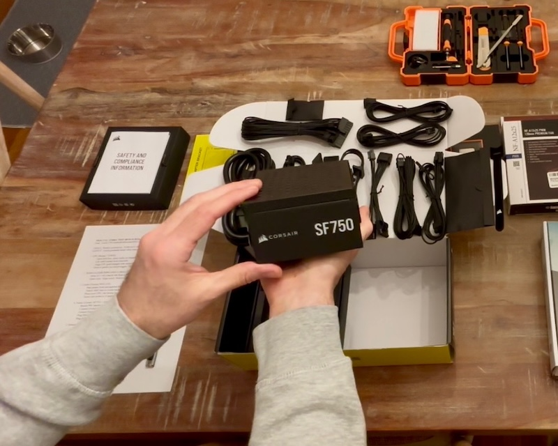{ loading=lazy }
  _Corsair SF750_

- 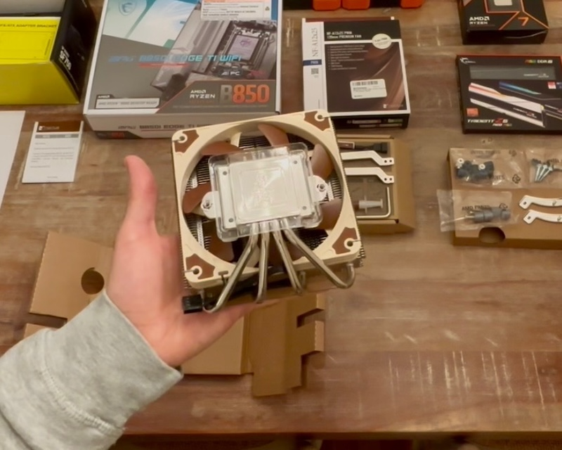{ loading=lazy }
  _Noctua NH-L12S_

- 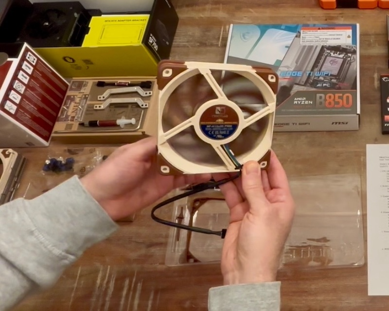{ loading=lazy }
  _Noctua NF-A12x25_

- 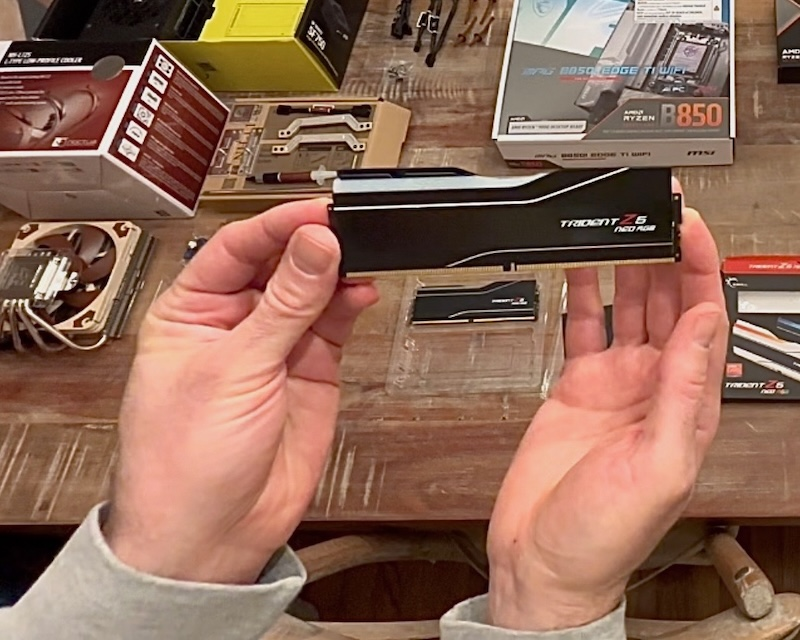{ loading=lazy }
  _G.SKILL Trident Z5 Neo RGB_

- { loading=lazy }
  _AMD Ryzen 7 9700X_

- 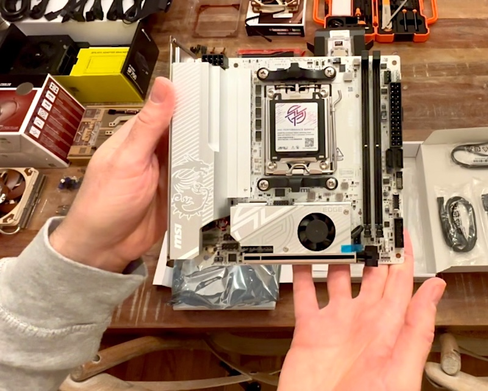{ loading=lazy }
  _MSI MPG B850I Edge_

- { loading=lazy }
  _CPU Installation_

- { loading=lazy }
  _RAM Installation_

- 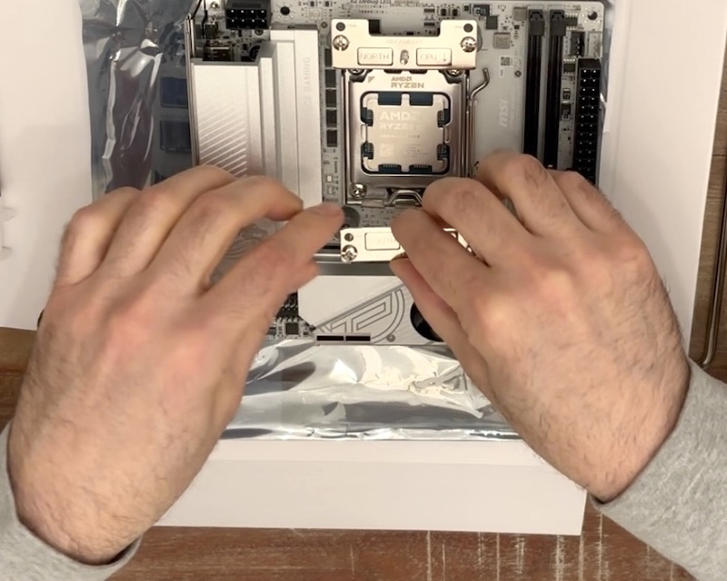{ loading=lazy }
  _Cooler Brackets Installation_

- 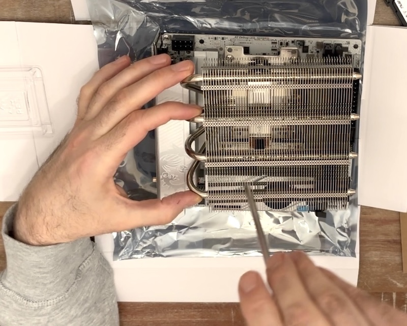{ loading=lazy }
  _CPU Cooler Installation_

- 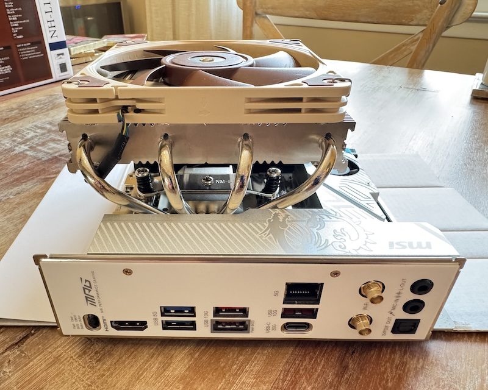{ loading=lazy }
  _Core Assembly_

- { loading=lazy }
  _Test Bench Ready_

- 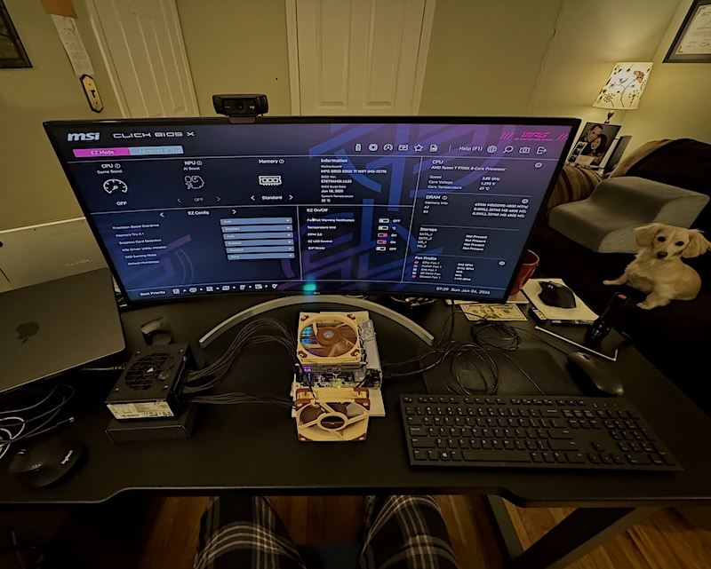{ loading=lazy }
  _From Boxes to BIOS_

- { loading=lazy }
  _Ubuntu Live!_

- { loading=lazy }
  _T-minus RGB..._

## Parts List

| # | Component | Details |
|---|-----------|---------|
| 1 | **Case** | Fractal Design Terra Jade (walnut front panel) |
| 2 | **CPU** | AMD Ryzen 7 9700X (8-core/16-thread, 65W TDP) |
| 3 | **CPU Cooler** | Noctua NH-L12S (low-profile, 120mm fan) |
| 4 | **Motherboard** | MSI MPG B850I Edge Ti WiFi (AM5 Mini-ITX) |
| 5 | **RAM** | G.SKILL Trident Z5 Neo RGB 64GB (2×32GB) DDR5-6000 EXPO |
| 6 | **Storage** | Samsung 990 PRO 2TB PCIe Gen4 M.2 |
| 7 | **PSU** | Corsair SF750 (2024) 80+ Platinum SFX |
| 8 | **Case Fans** | 2× Noctua NF-A12x25 PWM (120mm) |
| 9 | **Top Fan Bracket** | 25mm thick Etsy bracket for second intake fan |

## Build Progress So Far

I've received and unboxed the CPU, cooler, motherboard, RAM, PSU, and one case fan. Assembly started with an open-air test bench on cardboard to validate core components before final case installation.

- Installed Ryzen 7 9700X and RAM in slots A2/B2.
- Mounted NH-L12S with standard bars in diagonal orientation for VRM clearance.
- Switched the cooler fan to top position (intake blowing down) to ensure 44mm RAM clearance.
- Connected 24-pin ATX, 8-pin EPS, cooler fan to CPU_FAN header, and one case fan to SYS_FAN.
- First POST successful! :sunglasses:
- Enabled AMD EXPO profile and High-Efficiency Mode in BIOS → Confirmed 6000 MT/s memory speed.
- Booted Ubuntu 24.04 LTS live USB.
- Ran `inxi`, `sensors`, and a 5-minute `stress-ng` (16 threads) test:
  - Peak temperature: **50.6°C** (open air)
  - No thermal throttling or stability issues

The top fan bracket has arrived. Still awaiting the Terra case itself, the Samsung 990 PRO 2TB drive, and the second NF-A12x25 fan for final assembly and full Ubuntu installation.

The core system is now fully validated: stable, remarkably cool, and running at rated specifications on an open-air test bench. I'm excited to move everything into the beautiful Fractal Terra Jade case soon. Final assembly, meticulous cable management, Suricata IDS/IPS configuration, and full noise/power benchmarks are next once the remaining parts arrive.

Stay tuned for the completed build and real-world performance results!

*Joe Hawley*  
Fortune 500 Director | CISSP  
M.S. Cybersecurity Graduate Student @ Georgia Institute of Technology