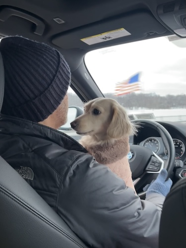

---
title:
---

# Cybersecurity Leader { .text-center }

Fortune 500 Director | CISSP  
M.S. Cybersecurity Graduate Student  
@ Georgia Institute of Technology

{ align=right alt="Hawley with his miniature dachshund, Daisy." .float-right width=280 }

Bridging cybersecurity and business value to guide risk-informed decisions that protect what matters while enabling innovation and growth.

Neurodivergent, self-taught coder with 20+ years in MedTech, turned enterprise leader. Raised on a North Carolina farm, now calling New York home. Former DJ, passionate about Japanese culture (bucket list: summit Mt. Fuji), sci-fi fan, and proud dog dad to miniature dachshund Daisy.

Thoughts on cybersecurity leadership and occasional experiments.