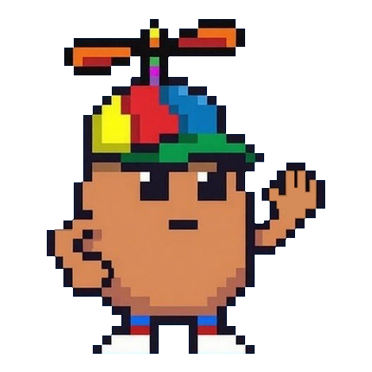
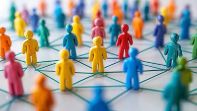
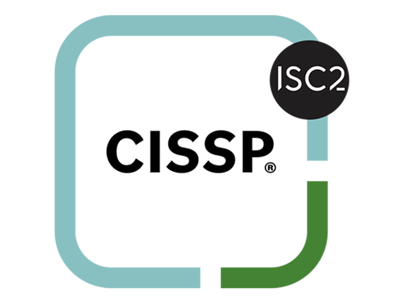

# Portfolio { .center-desktop }

Projects and noteworthy achievements

- 
  **Homelab for Graduate Research** · 2026  
  Built compact Fractal Terra homelab for cybersecurity graduate research.  
  [Learn more →](../articles/building-a-cybersecurity-homelab/){ target="_new" rel="noopener" }

- 
  **AI Fluency Certification** · 2025  
  Completed M365 Copilot AI Fluency certification and capstone project.  
  [Learn more →](https://www.linkedin.com/posts/joechawley_aifluency-aiinaction-cybersecurity-activity-7412170711093645312-mrTE){ target="_new" rel="noopener" }

- 
  **Accepted to Georgia Tech** · 2025  
  Accepted into Georgia Tech’s Master of Science in Cybersecurity program!  
  [Learn more →](https://www.linkedin.com/posts/joechawley_georgiatech-omscybersecurity-cybersecurity-activity-7401021029134839808-k-PJ/){ target="_new" rel="noopener" }

- 
  **Building Trusty Potato App** · 2025  
  Python/JS cybersecurity awareness quiz and phishing simulator.  
  [Learn more →](../articles/building-trusty-potato/){ target="_new" rel="noopener" }

- 
  **Embracing Autism Editorial** · 2025  
  How embracing my autism strengthened my cybersecurity career.  
  [Learn more →](https://www.thinkdigitalpartners.com/news/2025/09/09/how-embracing-my-autism-strengthened-my-cybersecurity-career/){ target="_new" rel="noopener" }

- 
  **ISC2 Think Tank Panelist** · 2025  
  "Embracing Neurodiversity  
  in Your Cyber Workforce"  
  [Learn more →](https://www.brighttalk.com/webcast/5385/648753){ target="_new" rel="noopener" }

- 
  **Earned CISSP** · 2024  
  Studied for ~7 months and passed the CISSP exam on my first attempt.  
  [Learn more →](https://www.credly.com/badges/55f12485-cccc-4b31-b8d1-c33d6402d4b9){ target="_new" rel="noopener" }

- 
  **Homelab for Blockchain** · 2021  
  Built custom Fractal Meshify C homelab for blockchain development.  
  [Learn more →](../articles/building-a-homelab-for-blockchain/){ target="_new" rel="noopener" }

